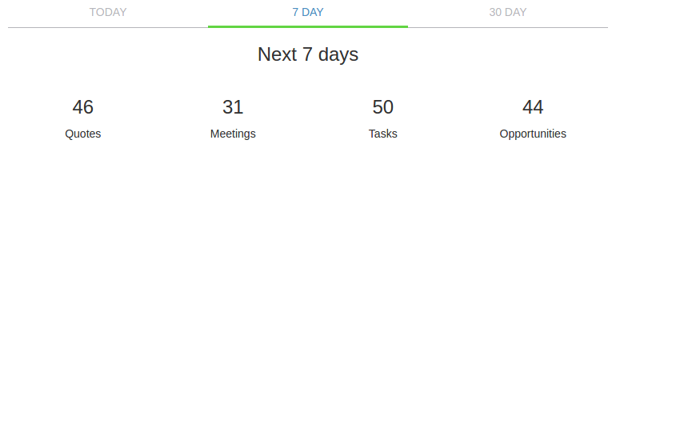
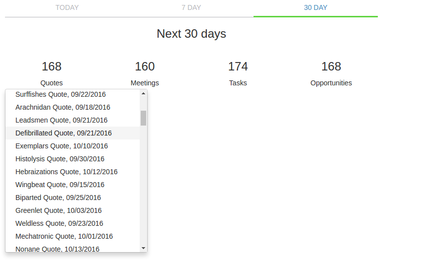

# KnockoutJS Upcoming Events Widget

### Uses:
* expressjs server for backend
* knockoutjs for viewmodel data binding
* momentjs for date actions
* lodash for utility
* bootstrap/less for styling
* webpack for server/client bundling (babel for transpiling)
* Q/jquery for promise/ajax for fetching data

### To run:
1. `npm install`
2. `npm run gen-data`
3. `npm run build`
4. `npm start`

### Or all in one:
1. `npm run launch`

then open up `http://localhost:1337/`

### Screenshots

